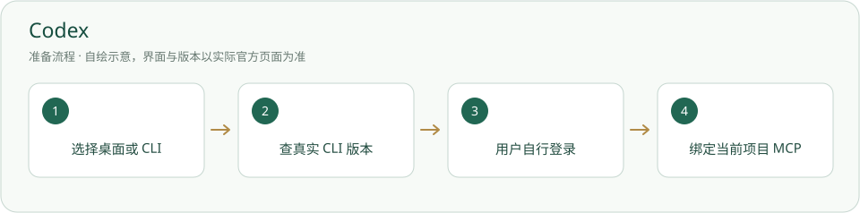

# Codex · 国内安装方案

国内可临时用 npmmirror 下载 npm 包；官方支持地区与账号实际可用性需单独核对；不能拿镜像安装通过当服务已通。



## 下载和安装来源

- [官方软件 / 项目入口](https://learn.chatgpt.com/docs/cli)
- [本方案下载 / 安装说明](https://registry.npmmirror.com)
- [完整安装、用途与排查指南](../%E8%BD%AF%E4%BB%B6/Codex.md)

国内包镜像方案：社区 npmmirror；认证与模型仍由厂商提供。

软件程序不放内置，位置由用户选择；当前实例可放非内置工具目录，不能让新项目复制整个安装环境。国内镜像是可选来源，下载来源、软件原发行者、模型服务是不同对象。

## 按顺序操作

1. 优先检查自己已有可用 CLI；选择 npm 方法才按 Node 主指南准备环境。

2. 下方只对当前命令指定 registry；不修改全局 npm，不复制作者的客户端或认证。

3. 检查版本，在自己的项目根按官方方式登录，再按主指南连接 MCP。

## 账号、模型和服务地区

CLI 可按官方登录自己的 ChatGPT 账号；npm 镜像仅下载程序，不提供 OpenAI 服务。大陆中国未列于当前 ChatGPT 官方支持地区，不能承诺国内无需网络处理即可使用服务；已在官方支持地区的用户按本人账号核对。

## 核对真实结果

版本真实可读后还需本人登录、模型任务和正确项目 MCP 实验；不要自动启动员工。

以下命令仅作说明，写文档时没有执行安装、登录、启用或启动。先读命令注释和主指南；有占位路径时替换为自己真实值。安装命令只给本次选择来源，不写全局 pip/npm 配置。

```powershell
node --version
npm.cmd --version
npm.cmd install -g @openai/codex@latest --registry=https://registry.npmmirror.com
codex --version
```

## 下载或运行失败

1. 记录失败的具体地址、步骤、时间与完整报错，先确认系统架构、版本和解释器。
2. 镜像缺包或不同步时对照原官方发行；没有核到国内独立渠道的条目保留官方入口，不猜代理站和网盘。
3. 账号、配额、地区限制归模型服务，包下载成功不能替代服务检查；[国内 / 国外方案总览](../国内与国外方案.md)提供另一入口。
4. 无当前安装检查适配时显示未检查；没有实际 MCP 连接结果也不补成已连通。当前授权不足的动作依项目原有流程记录待决定。

## 来源与核验

核验日期：2026-10-05。只读检查官方或镜像维护方说明；没有实测全国网络、安装客户端或登录所有账号。清华镜像由 TUNA 维护，npmmirror 是社区包镜像，不冒称软件厂商的国内发行。

- [官方 CLI](https://learn.chatgpt.com/docs/cli)
- [官方支持地区](https://help.openai.com/en/articles/7947663-chatgpt-supported-countries)
- [npmmirror 来源](https://npmmirror.com/)

[返回完整指南](../%E8%BD%AF%E4%BB%B6/Codex.md) · [安装总览](../从这里开始.md)
