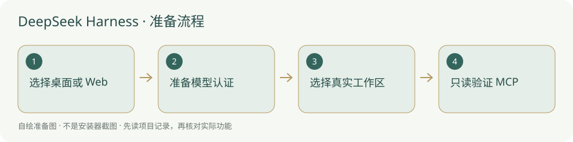

# DeepSeek Harness · 国外安装方案

同一 DeepSeek 官网与官方 npm 来源；所选模型提供方地区另核。



## 下载和安装来源

- [官方软件 / 项目入口](https://www.deepseek.com/harness/)
- [本方案下载 / 安装说明](https://www.deepseek.com/harness/)
- [完整安装、用途与排查指南](../%E8%BD%AF%E4%BB%B6/DeepSeek%20Harness.md)

国外官方来源；没有独立国际发行的明确标注同一官网，不捏造全球版。

软件程序不放内置，位置由用户选择；当前实例可放非内置工具目录，不能让新项目复制整个安装环境。国内镜像是可选来源，下载来源、软件原发行者、模型服务是不同对象。

## 按顺序操作

1. 打开上面的 国外入口，确认产品名称和当前系统架构。

2. 桌面按官方安装器；选择 CLI/Web UI 时使用下面临时 registry 命令，之后按官方 Web UI 准备本人模型认证。

3. 打开本项目根，先读 AGENTS.md；按主指南已核到的 MCP 方法只读核对，未核到入口的用普通文件接手。

4. 记录客户端实际版本、项目名称及本次检查结果，不猜未检查状态。

## 账号、模型和服务地区

Web UI 按官方 provider 指南准备自己可用的模型 API key，OAuth provider 当前未支持；下载原客户端不代表所选模型在所有地区可用。

## 核对真实结果

按完整指南核实际客户端与项目。官方 Web UI 指南当前要求模型 API key，不能把此客户端说成全程无需 API。

以下命令仅作说明，写文档时没有执行安装、登录、启用或启动。先读命令注释和主指南；有占位路径时替换为自己真实值。安装命令只给本次选择来源，不写全局 pip/npm 配置。

```powershell
node --version
# 下面会主动下载并启动官方 Web UI；按你的真实项目目录和授权决定是否运行
npm.cmd exec --registry=https://registry.npmjs.org --package=@deepseek-ai/dsh -- dsh web
```

## 下载或运行失败

1. 记录失败的具体地址、步骤、时间与完整报错，先确认系统架构、版本和解释器。
2. 镜像缺包或不同步时对照原官方发行；没有核到国内独立渠道的条目保留官方入口，不猜代理站和网盘。
3. 账号、配额、地区限制归模型服务，包下载成功不能替代服务检查；[国内 / 国外方案总览](../国内与国外方案.md)提供另一入口。
4. 无当前安装检查适配时显示未检查；没有实际 MCP 连接结果也不补成已连通。当前授权不足的动作依项目原有流程记录待决定。

## 来源与核验

核验日期：2026-10-05。只读检查官方或镜像维护方说明；没有实测全国网络、安装客户端或登录所有账号。清华镜像由 TUNA 维护，npmmirror 是社区包镜像，不冒称软件厂商的国内发行。

- [官方主入口](https://www.deepseek.com/harness/)
- [官方安装 / 下载](https://www.deepseek.com/harness/)
- [官方 MCP 插件配置](https://github.com/deepseek-ai/deepseek-harness/blob/master/packages/mcp/mcp-client/README.md)
- [官方品牌使用规范](https://github.com/deepseek-ai/deepseek-harness/blob/master/BRAND_GUIDELINES.zh.md)

[返回完整指南](../%E8%BD%AF%E4%BB%B6/DeepSeek%20Harness.md) · [安装总览](../从这里开始.md)
