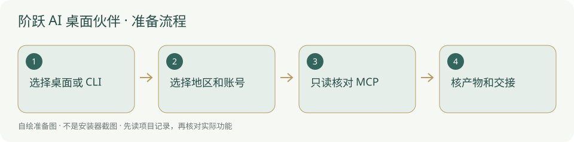

# 阶跃 AI / Step Code · 国外安装方案

国际 Step Plan Oversea 账号套餐 OAuth；同一官方 Step Code 客户端。



## 下载与官方来源

- [桌面伙伴下载](https://chat.stepfun.com/download)
- [Step Code 官方安装说明](https://github.com/stepfun-ai/Step-Code)
- [本方案账号套餐](https://platform.stepfun.ai/step-plan)
- [完整用途、MCP 与安装排查](../软件/阶跃%20AI.md)

桌面伙伴与 Step Code 是两种入口，不需要全部安装。Step Code 由官方安装脚本获取；Windows 原生 beta，官方建议 WSL。桌面官网列 Windows/macOS，具体架构以实际下载按钮为准。程序放用户自选非内置位置，认证与会话目录不带进新项目。

## 按顺序操作

1. 先选择形态。桌面走下载页；终端打开官方 README 核对安装器与当前系统，阅读脚本后再由本人决定安装。
2. Step Code 的 PowerShell 官方安装命令见完整主指南；本方案没有执行远程脚本或替人安装 WSL。
3. 新开终端检查 `step --version`，从自己真实项目根启动；不运行 `/init` 改写已有项目规则。
4. `step login` / `/login` 选择 Step Plan Oversea，用本人账号通过浏览器 OAuth；套餐按该账号当前实际状态。另一种 API key 认证属于自选按量方式，不冒充账号套餐免 key。
5. Step Code 先核当前版 `step mcp --help`，再照官方仓库配置文档与完整主指南加本地研究工作台；桌面外部 stdio MCP 没有核到，先用普通项目文件。

## 账号与模型服务

官方 README 区分国内 platform.stepfun.com 与国际 platform.stepfun.ai。它们选择 Step 服务地区与计费方式，不是两个独立模型 provider。国际选择 Step Plan Oversea OAuth 套餐账号；国际 API key 来源是 platform.stepfun.ai/interface-key。

账号套餐登录这条路径不要求手工填 API key；API key 模式仍按自己授权和当前服务条款。下载客户端不代表当前地区、账号及所有套餐可用，本轮没有实际登录。

## 核对真实结果

以下是说明命令，没有在本文编写时执行安装、登录或模型任务；状态只在本机查看，不向模板复制凭据。

```powershell
step --version
step --help
step login status
step mcp --help
Test-Path "<项目绝对路径>/AGENTS.md"
```

版本、模型与认证核对后，MCP 必须真读到本项目才记已连通。平台尚未新增 Step Code 自动运行器适配，网页状态不能由说明自动推成已安装。桌面在“关于”单独查版本。

## 失败与核验范围

原生 beta 或下载失败保留系统、版本和报错；不猜镜像站或私自装系统组件。模型认证与 MCP 连接是两步，分别查账号地区和本地 Python/参数。官方技术文档注明实现分支，实际版没有命令时保留未知，按当前 README 处理。

核验日期：2026-10-05。官方资料只读核验；没有实测全国网络、登录、安装或平台运行器适配。

- [官方 README：安装、地区认证和 MCP](https://github.com/stepfun-ai/Step-Code)
- [官方 MCP 配置技术文档](https://github.com/stepfun-ai/Step-Code/blob/main/docs/step-unified-config-and-mcp.md)
- [本方案账号套餐](https://platform.stepfun.ai/step-plan)
- [本方案 API key（自选路径）](https://platform.stepfun.ai/interface-key)
- [官方桌面下载](https://chat.stepfun.com/download)

[完整指南](../软件/阶跃%20AI.md) · [两套方案总览](../国内与国外方案.md)
