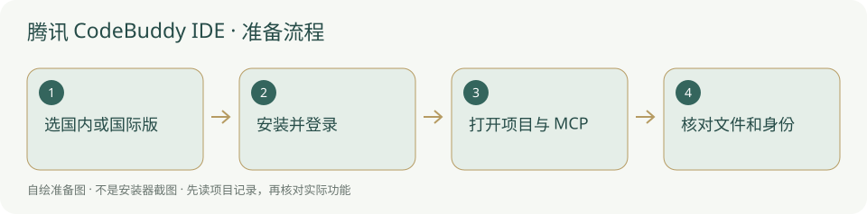

# 腾讯 CodeBuddy IDE · 安装与使用

腾讯编程 IDE，国内版与国际版分别选择账号和安装入口。

> IDE、编辑器插件与 CodeBuddy Code CLI 是不同形式，不能混成一种运行器。



## 什么时候需要

需要腾讯图形编程 IDE 阅读与修改当前项目时；本页聚焦独立 IDE，不把 CLI 企业功能当桌面版已验证功能。

## 输入、调用与输出

输入：自己的项目目录、规则与获准任务。调用：CodeBuddy IDE 的工具模式和可选 MCP。输出：文件修改、运行检查、项目交付和交接。

## 官网与下载入口

- [官方入口](https://www.codebuddy.cn/ide/)
- [官方软件下载 / 安装说明](https://www.codebuddy.cn/ide/)
- [国内安装方案](../方案/codebuddy-cn.md)
- [国外安装方案](../方案/codebuddy-global.md)

## Windows 与安装位置

按官方安装页选择 Windows 安装器及合适处理器；Windows 安装向导支持当前用户安装与自选位置。Mac 按芯片选包；其他发行以实时下载页为准。本次没有试装或宣称跨系统通过。

本项目本轮只读核验资料，未试装该客户端、未登录账号、未扩大系统支持范围。

## 操作步骤

1. 国内账号选 codebuddy.cn/ide；国际账号选 codebuddy.ai/ide，不把两站下载与认证混用。

2. 打开官方安装说明，Windows 执行下载好的安装器，按向导选择当前用户、协议和非内置安装位置。

3. 国内按官方提供的微信或手机号登录；国际官方安装页说明 Google/GitHub/Email。使用自己的账号并核对额度。

4. 打开本项目根，先读 AGENTS.md；设置中的 MCP 页面可 Add MCP，通过官方 JSON 配置加入本地研究工作台。

5. 先读取总览并核对真实项目，再执行范围内的任务；需要自动开工另依平台已支持运行器判断。

## 安装授权与调用范围

安装目录由你选择，内置只带说明与图示，不把程序和认证复制到新项目。软件安装、文件写入、连接 MCP、自动开工分别按实际权限和已有授权执行；安装了客户端不能当作允许修改所有项目。个人账号、密钥和数据保留本机，不写进模板。

## 怎么检查成功

下面是供用户操作的说明命令，**本次没有执行安装或启动客户端**。先替换占位为本机真实路径；检查命令不是成功记录。

```powershell
Test-Path "<项目绝对路径>/AGENTS.md"
& "<后台实际 python.exe 路径>" -m pip show mcp
```

关于、账号、模型与当前工作目录真实可用；MCP 工具实际能读本项目。只有 IDE 下载成功不等于 CodeBuddy Code CLI 能被平台启动。

## MCP 与项目接手

官方 IDE MCP 页给出的 stdio 结构包含 type、command、args；以当前页面格式包裹本服务参数。服务名填 `research-console`；传输选 **stdio / 本地命令**，Python 用后台同一个解释器的完整路径。参数按下面顺序独立填写：

```text
<项目绝对路径>/backend/mcp_server.py
--project
<项目绝对路径>
--agent
<你自己这位员工的名称>
```

路径与员工名必须替换为本机真实值。不要照抄作者个人路径、历史 G 编号或他人的账户。第一次只让客户端调用 `get_overview` / `list_skills`，核对网页项目名称；随后依照 [Agent接入](../Agent接入.md) 报到、读取适用戒律。Python 找得到、MCP 已连接、模型能调用工具和自动运行器已适配，是四个不同的检查。


## 失败时怎样处理

- 登录回跳失败：确认当前安装版本和登录站的地区一致，保留报错。

- MCP JSON 错误：按当前官方格式核对 type/command/args，路径用正斜杠或正确 JSON 转义。

- 选择 WorkBuddy 后找不到同一入口：它是另一桌面应用，查看独立指南。

## 官方来源与核验范围

核验日期：2026-10-05。核验官方页面和公开说明，不等于真实下载安装、登录、额度或本项目 MCP 实连验收。未核到的入口明确保留未知；本轮没有新增客户端运行器适配。

- [国内 IDE](https://www.codebuddy.cn/ide/)
- [国内安装](https://www.codebuddy.cn/docs/ide/Getting-Started/Installation)
- [国际 IDE](https://www.codebuddy.ai/ide)
- [国际安装与登录](https://www.codebuddy.ai/docs/ide/Getting-Started/Installation)
- [官方 IDE MCP](https://www.codebuddy.cn/docs/ide/User-guide/MCP)

[返回安装指南总览](../从这里开始.md)


## 国内与国外安装方案

[国内安装方案](../方案/codebuddy-cn.md) · [国外安装方案](../方案/codebuddy-global.md)。入口区分下载来源、账号与模型服务；镜像不等于服务可用。详细选择见[两套方案总览](../国内与国外方案.md)。


## 官方小标识

-

[标识来源官网](https://codebuddy.cn/ide)；原样保存，用于识别软件/来源。详细出处、权利与使用条件见[图片来源](../应用图片/来源.md)。


## 官方页面入口

-

来源：[官方下载 / 产品页](https://www.codebuddy.cn/ide/)；截图日期：2026-10-05。用于定位官方下载入口，不代表本机已安装、登录或实连。记录见[截图来源](../应用截图/来源.md)。
