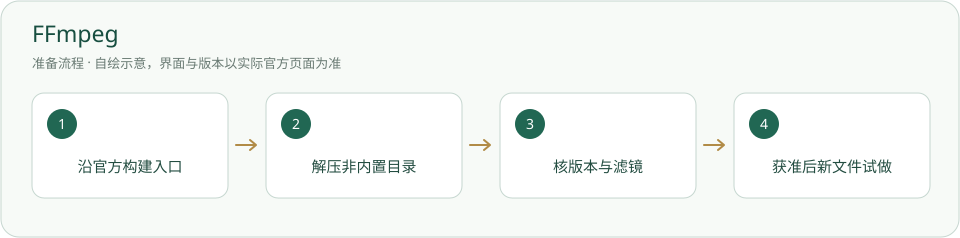

# FFmpeg · 安装与使用

按获准命令剪辑视频、截图和检查媒体；程序不随包。

> 官方只提供源码及构建入口；Windows 构建须沿官方页面选择来源。



## 什么时候需要

agent 需要剪获准视频、制作截图或查看媒体信息。仅在平台看视频不需要安装。

## 输入、调用与输出

输入：授权视频、字幕和明确剪辑要求。调用：ffmpeg、ffprobe。输出：指定的新媒体文件和操作记录；原素材只读，输出不覆盖。

## 官网与下载入口

- [官方入口](https://ffmpeg.org/)
- [下载或官方安装说明](https://ffmpeg.org/download.html)

## Windows 与安装位置

从官方列出的 Windows 构建选 ZIP 完整解压到非内置工具目录，例如工具库/下载/FFmpeg。记录 bin/ffmpeg.exe 与 ffprobe.exe 的实际位置。PATH 由用户决定，完整路径也可直接调用。

本页面向 Windows 桌面；其他系统请选官网对应发行并按其说明操作，本项目未在本轮宣称跨系统实测。

## 操作步骤

1. 打开 FFmpeg 官方下载页，选择 Windows 栏官方列出的 gyan.dev 或 BtbN，确认架构和构建许可。

2. 需要常用功能可选 gyan.dev release essentials ZIP；取对应 sha256 校验信息，核对下载完整性，不把半个压缩包当成功。

3. 完整解压到选择的位置。下面检查命令若用 PATH，先确保新终端能找到程序；否则改成 exe 完整路径。

4. 检查版本与字幕、加字、加框三个滤镜。只有版本通过，不能承诺全部剪辑功能可用。

5. 经素材授权再做一张新文件名截图。现有剪辑网页未实现，agent 用命令卡操作。

## 安装授权与调用范围

用户自己运行下面的安装命令前，确认安装对象、位置、来源与许可。agent 只有得到对应安装授权才能执行；已有明确授权可引用原记录。安装软件、启用插件、允许自动开工是三件不同的事。指南不会自动下载安装、登录、启用插件或启动员工。可执行软件不放入必须复制的内置资料。

## 怎么检查成功

下面是给你操作的命令说明，本次写文档没有实际执行安装。带示例目录的命令先替换真实路径；项目相对路径命令在项目根执行。

```powershell
ffmpeg -version
ffprobe -version
ffmpeg -hide_banner -filters | Select-String 'subtitles|drawtext|drawbox'
Get-Command ffmpeg,ffprobe -ErrorAction SilentlyContinue | Select-Object Name,Source
```

两个版本可见，需要的三个滤镜都在；功能试做的截图能打开。记录构建来源及实际版本，不自动替换现有版本。

## 失败时怎样处理

- 找不到命令：用实际 bin 完整路径；改变 PATH 后重开终端和平台后台。

- 缺 subtitles/drawtext：当前构建未必带所需库，记录构建参数和缺项，按明确授权换构建；不猜许可证。

- 输出已存在：换新文件名，命令保留 -n；不加 -y 强行覆盖。

## 程序许可与本项目

FFmpeg 构建可能按 LGPL 或 GPL；gyan.dev 页面说明其构建为 GPLv3。这里提供下载入口和自写步骤，**不把 FFmpeg 程序或源码打包进项目**。不要把平台许可当 FFmpeg 的许可。操作要求见[剪辑插件指南](剪辑插件.md)。


## 官方来源与核验范围

核验日期：2026-10-05。只读查看官方资料与本项目现有文件；软件、账户、实际安装和功能试跑并未在本文编写时重新验收。正文访问受限的来源在条目中标明，不把检索结果写成安装成功。

- [FFmpeg 官方下载与构建入口](https://ffmpeg.org/download.html)
- [官方列出的 gyan.dev 构建](https://www.gyan.dev/ffmpeg/builds/)
- [FFmpeg 官方许可说明](https://ffmpeg.org/legal.html)

[返回安装指南总览](../从这里开始.md)


## 官方页面入口

-

来源：[https://ffmpeg.org/download.html](https://ffmpeg.org/download.html)；截图日期：2026-10-05。请从上述官网链接进入，实际版本与安装选项以你打开官网时为准。原网站及标识权利归原方；使用说明见[截图来源](../应用截图/来源.md)。


## 国内与国外安装方案

[国内安装方案](../方案/ffmpeg-cn.md) · [国外安装方案](../方案/ffmpeg-global.md)。入口区分下载来源、账号与模型服务；镜像不等于服务可用。详细选择见[两套方案总览](../国内与国外方案.md)。


## 官方小标识

-

[标识来源官网](https://ffmpeg.org/download.html)；原样保存，用于识别软件/来源。详细出处、权利与使用条件见[图片来源](../应用图片/来源.md)。
