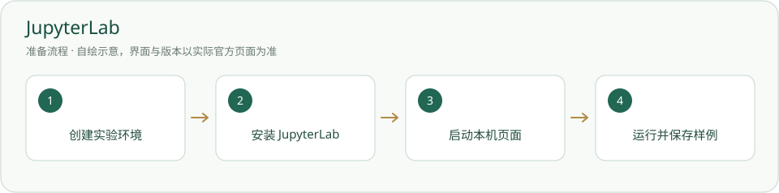

# JupyterLab · 安装与使用

在独立实验环境运行 Notebook，保留步骤、结果与环境。

> 不属于后台必需依赖；数据与模型库按具体实验方案另配。



## 什么时候需要

需要可复现的数据分析或 Notebook 实验。不会因为安装本页工具就自动完成全部实验。

## 输入、调用与输出

输入：获准 Notebook、数据与实验依赖。调用：实验环境的 JupyterLab。输出：.ipynb、实际结果、图表与运行记录，保存到对应业务模块。

## 官网与下载入口

- [官方入口](https://jupyter.org/)
- [下载或官方安装说明](https://jupyter.org/install)

## Windows 与安装位置

为实验单独选择非内置环境目录，例如工具库/环境/实验；Notebook 和数据放业务材料目录。不要给后台环境盲装全部科研库。

本页面向 Windows 桌面；其他系统请选官网对应发行并按其说明操作，本项目未在本轮宣称跨系统实测。

## 操作步骤

1. 先准备 Python，并在项目根创建新的实验环境；既有环境先检查，不覆盖。

2. 用下面环境的完整解释器路径安装 JupyterLab。需要其他库时按实验计划增加，并记录实际版本。

3. 运行版本检查，再启动本机 JupyterLab；使用终端给出的本机地址，含访问令牌的完整地址只自己使用。

4. 新建 Notebook，运行 `1 + 1` 得到 2，保存到获准实验目录，重开核对；按需另做真实数据测试。

## 安装授权与调用范围

用户自己运行下面的安装命令前，确认安装对象、位置、来源与许可。agent 只有得到对应安装授权才能执行；已有明确授权可引用原记录。安装软件、启用插件、允许自动开工是三件不同的事。指南不会自动下载安装、登录、启用插件或启动员工。可执行软件不放入必须复制的内置资料。

## 怎么检查成功

下面是给你操作的命令说明，本次写文档没有实际执行安装。带示例目录的命令先替换真实路径；项目相对路径命令在项目根执行。

```powershell
python -m venv 工具库/环境/实验
& './工具库/环境/实验/Scripts/python.exe' -m pip install jupyterlab
& './工具库/环境/实验/Scripts/python.exe' -m jupyterlab --version
& './工具库/环境/实验/Scripts/python.exe' -m jupyterlab
```

版本可读、本机页面可打开、示例单元执行和保存成功。Jupyter 可运行不代表研究结果正确或模型依赖齐全。

## 失败时怎样处理

- ModuleNotFoundError：核对环境的完整路径与 Notebook 内核，不把启动环境和内核混为一谈。

- 浏览器连不上：检查终端真实地址、服务是否仍在；不要公开令牌或开放到外网。

- 实验缺包：记录缺项，按实验授权补，不自动安装 GPU 驱动、CUDA 或购买算力。

## 官方来源与核验范围

核验日期：2026-10-05。只读查看官方资料与本项目现有文件；软件、账户、实际安装和功能试跑并未在本文编写时重新验收。正文访问受限的来源在条目中标明，不把检索结果写成安装成功。

- [Jupyter 官方安装](https://jupyter.org/install)
- [Python venv](https://docs.python.org/3/library/venv.html)

## 官方标识与来源

[-](https://jupyter.org/)

Jupyter® 及 Jupyter 标识属于 LF Charities；MiracleHarness 依据其指称使用政策识别 Project Jupyter，未改图。设计资产 Copyright (c) 2014, Project Jupyter。

官方商标政策允许用未修改标识指称 Jupyter；这里识别 JupyterLab 所属项目，不表示赞助。 详见[图片来源与使用条件](../应用图片/来源.md)。

[返回安装指南总览](../从这里开始.md)


## 国内与国外安装方案

[国内安装方案](../方案/jupyterlab-cn.md) · [国外安装方案](../方案/jupyterlab-global.md)。入口区分下载来源、账号与模型服务；镜像不等于服务可用。详细选择见[两套方案总览](../国内与国外方案.md)。
