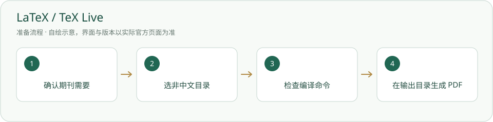

# LaTeX / TeX Live · 安装与使用

在本机把论文 .tex 编译成 PDF；中文项目通常用 XeLaTeX。

> 仅需本地命令行排版时安装；本轮没有重新安装 TeX Live。



## 什么时候需要

期刊模板或论文工程要求 .tex，且当前 agent 环境没有可用编译器。已有可用编译环境时复用。

## 输入、调用与输出

输入：获准 .tex、.bib 和图片。调用：latexmk / xelatex。输出：指定输出目录中的 PDF、日志和中间文件；不改写输入稿件。

## 官网与下载入口

- [官方入口](https://www.latex-project.org/get/)
- [下载或官方安装说明](https://tug.org/texlive/acquire-netinstall.html)

## Windows 与安装位置

TeX Live 安装目录应使用不含中文等非 ASCII 字符的独立目录，例如 D:/Tools/texlive/2026，位置和磁盘空间由用户确认；不要直接放进本项目内置。

本页面向 Windows 桌面；其他系统请选官网对应发行并按其说明操作，本项目未在本轮宣称跨系统实测。

## 操作步骤

1. 先打开 LaTeX 官方获取页，选择 Windows 的 TeX Live；也可沿 TUG 官方下载页进入 CTAN 安装器。

2. 下载网络安装器后运行。选择非中文目录并查看安装器显示的方案、磁盘需求和镜像；不要把安装器大小当完整 TeX 大小。

3. 完成后新开终端，检查 latexmk、xelatex。缺字体和宏包时按本工程要求处理，不全局乱升级。

4. 只在自己授权的测试目录编译样例。下面主文件.tex 与输出均为示例，先用你自己的工程替换；不去读作者私人论文。

## 安装授权与调用范围

用户自己运行下面的安装命令前，确认安装对象、位置、来源与许可。agent 只有得到对应安装授权才能执行；已有明确授权可引用原记录。安装软件、启用插件、允许自动开工是三件不同的事。指南不会自动下载安装、登录、启用插件或启动员工。可执行软件不放入必须复制的内置资料。

## 怎么检查成功

下面是给你操作的命令说明，本次写文档没有实际执行安装。带示例目录的命令先替换真实路径；项目相对路径命令在项目根执行。

```powershell
latexmk -v
xelatex --version
latexmk -xelatex -interaction=nonstopmode -file-line-error -outdir=输出 主文件.tex
```

版本检查通过，编译退出正常，输出目录生成实际 PDF；检查 PDF 页数、文字和公式。版本存在不代表工程编译已通过。

## 失败时怎样处理

- 目录包含中文：按 TeX Live 官方要求选择非 ASCII 限制之外的安装位置；不要搬走现有项目来碰运气。

- 下载失败：保留安装日志与安装器记录，不重复下载整套 ISO。

- 中文字体/宏包缺失或编译失败：读实际 .log，按任务协议两次同类失败后记录缺口，不编造“已出 PDF”。

## 官方来源与核验范围

核验日期：2026-10-05。只读查看官方资料与本项目现有文件；软件、账户、实际安装和功能试跑并未在本文编写时重新验收。正文访问受限的来源在条目中标明，不把检索结果写成安装成功。

- [LaTeX 官方获取入口（正文已浏览）](https://www.latex-project.org/get/)
- [TeX Live 网络安装器（官方检索已核对；本轮正文403）](https://tug.org/texlive/acquire-netinstall.html)
- [TeX Live Windows 限制（官方检索已核对；本轮正文403）](https://tug.org/texlive/windows.html)

[返回安装指南总览](../从这里开始.md)


## 官方页面入口

-

来源：[https://www.latex-project.org/get/](https://www.latex-project.org/get/)；截图日期：2026-10-05。请从上述官网链接进入，实际版本与安装选项以你打开官网时为准。原网站及标识权利归原方；使用说明见[截图来源](../应用截图/来源.md)。


## 国内与国外安装方案

[国内安装方案](../方案/texlive-cn.md) · [国外安装方案](../方案/texlive-global.md)。入口区分下载来源、账号与模型服务；镜像不等于服务可用。详细选择见[两套方案总览](../国内与国外方案.md)。
