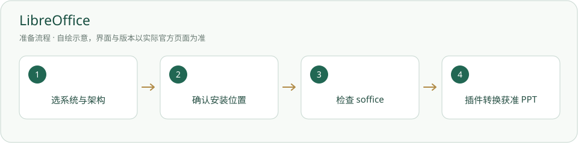

# LibreOffice · 安装与使用

免费桌面办公软件，可为 PPT 预览提供本地 PDF 转换。

> PPT 插件通过可能使用 PowerPoint，不等于 LibreOffice 已安装。



## 什么时候需要

电脑没有可用 PowerPoint，而需要 PPT 原排版预览；或希望自己编辑 Office 文件。

## 输入、调用与输出

输入：用户授权的 Office 文件。调用：桌面应用，或 PPT 插件的只读转换。输出：用户指定的新文件、插件预览缓存 PDF；原 PPT 不改。

## 官网与下载入口

- [官方入口](https://www.libreoffice.org/)
- [下载或官方安装说明](https://www.libreoffice.org/download/)

## Windows 与安装位置

默认目录便于现有插件发现；选择 Custom 可以自定非内置目录。若自选目录，后台启动环境的 PATH 须能找到 soffice；现有插件不会从任意目录自动发现。

本页面向 Windows 桌面；其他系统请选官网对应发行并按其说明操作，本项目未在本轮宣称跨系统实测。

## 操作步骤

1. 打开官方下载页，选 Windows x86-64 或 ARM64，核对操作系统支持。

2. 运行安装器；Default 用默认位置，Custom 用自选位置。是否关联 Office 文件、建快捷方式和开机启动由用户选择，不强改。

3. 启动 LibreOffice，查看帮助/关于；在实际 program 目录检查 soffice 版本。

4. 在工作台根运行 PPT 插件检查。结果是“用 PowerPoint”只说明另一个转换器可用；LibreOffice 自己仍须按第 3 步检查。

5. 打开一份获准 PPT，由人选择 PPT 预览并核对生成 PDF 的排版和页数。

## 安装授权与调用范围

用户自己运行下面的安装命令前，确认安装对象、位置、来源与许可。agent 只有得到对应安装授权才能执行；已有明确授权可引用原记录。安装软件、启用插件、允许自动开工是三件不同的事。指南不会自动下载安装、登录、启用插件或启动员工。可执行软件不放入必须复制的内置资料。

## 怎么检查成功

下面是给你操作的命令说明，本次写文档没有实际执行安装。带示例目录的命令先替换真实路径；项目相对路径命令在项目根执行。

```powershell
& 'C:/Program Files/LibreOffice/program/soffice.exe' --version
powershell -NoProfile -ExecutionPolicy Bypass -File 插件/PPT预览/检查.ps1
```

实际 soffice 给出版本；插件检查可用。命令中的位置应换成真实安装目录；转换后另核 PDF，不能只报“已安装”。

## 失败时怎样处理

- 自选目录检查失败：确认 program/soffice.exe，明确选择后台能找到的路径；重开终端和后台再查，不暗中修改整机 PATH。

- 排版不同：核对字体和原 PPT，不把 PDF 动画缺失当程序未装。

- 后台已有 PowerPoint：可以继续复用，无须为了安装清单再装一个转换器。

## 官方来源与核验范围

核验日期：2026-10-05。只读查看官方资料与本项目现有文件；软件、账户、实际安装和功能试跑并未在本文编写时重新验收。正文访问受限的来源在条目中标明，不把检索结果写成安装成功。

- [LibreOffice 下载](https://www.libreoffice.org/download/)
- [官方 Windows 安装说明](https://www.libreoffice.org/installation-instructions/)

[返回安装指南总览](../从这里开始.md)


## 官方页面入口

-

来源：[https://www.libreoffice.org/download/](https://www.libreoffice.org/download/)；截图日期：2026-10-05。请从上述官网链接进入，实际版本与安装选项以你打开官网时为准。原网站及标识权利归原方；使用说明见[截图来源](../应用截图/来源.md)。


## 国内与国外安装方案

[国内安装方案](../方案/libreoffice-cn.md) · [国外安装方案](../方案/libreoffice-global.md)。入口区分下载来源、账号与模型服务；镜像不等于服务可用。详细选择见[两套方案总览](../国内与国外方案.md)。


## 官方小标识

-

[标识来源官网](https://www.libreoffice.org/download/)；原样保存，用于识别软件/来源。详细出处、权利与使用条件见[图片来源](../应用图片/来源.md)。
