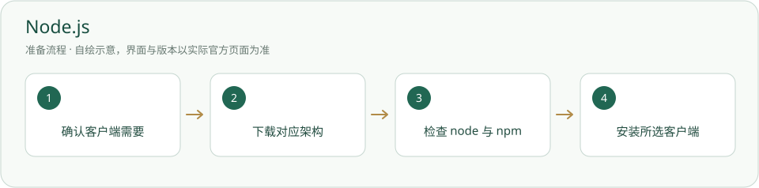

# Node.js · 安装与使用

部分 agent CLI 的 npm 安装方式需要它；平台网页本身不需要。

> 只有选择 npm 客户端安装方式时准备；没有本项目工具卡检测，状态应是未检查。



## 什么时候需要

选择 Codex 或 Qwen Code 的 npm 安装方式；已有符合该客户端要求的 Node 则复用。

## 输入、调用与输出

输入：获准客户端的 npm 包名称。调用：npm.cmd。输出：本机客户端程序及依赖，不是平台前端构建结果。

## 官网与下载入口

- [官方入口](https://nodejs.org/)
- [下载或官方安装说明](https://nodejs.org/en/download)

## Windows 与安装位置

使用官方下载的 Windows 安装器选择系统目录或自选非内置工具目录；不把 Node/npm 程序放进内置指南。

本页面向 Windows 桌面；其他系统请选官网对应发行并按其说明操作，本项目未在本轮宣称跨系统实测。

## 操作步骤

1. 在“系统 → 关于”确认架构，去官网下载 Windows 对应安装器。

2. 选择符合目标客户端要求的受支持 LTS 系列；Qwen 手动安装文档要求 Node 22 或更高。

3. 运行安装器，确认 npm 组件；是否修改 PATH 由你决定。完成后新开 PowerShell。

4. 检查 Node 和 npm.cmd，再到所选客户端指南。无需安装所有客户端。

## 安装授权与调用范围

用户自己运行下面的安装命令前，确认安装对象、位置、来源与许可。agent 只有得到对应安装授权才能执行；已有明确授权可引用原记录。安装软件、启用插件、允许自动开工是三件不同的事。指南不会自动下载安装、登录、启用插件或启动员工。可执行软件不放入必须复制的内置资料。

## 怎么检查成功

下面是给你操作的命令说明，本次写文档没有实际执行安装。带示例目录的命令先替换真实路径；项目相对路径命令在项目根执行。

```powershell
node --version
npm.cmd --version
Get-Command node,npm.cmd -ErrorAction SilentlyContinue | Select-Object Name,Source
```

显示两个版本及实际命令路径；另核对所选客户端的版本要求。

## 失败时怎样处理

- 找不到命令：新开终端，核对安装路径。

- PowerShell 阻止 npm.ps1：先用随带的 npm.cmd，不为解决此事降低整机执行策略。

- 安装客户端失败：保存 npm 报错，核对网络、架构和包名；不安装来历不明的同名工具。

## 官方来源与核验范围

核验日期：2026-10-05。只读查看官方资料与本项目现有文件；软件、账户、实际安装和功能试跑并未在本文编写时重新验收。正文访问受限的来源在条目中标明，不把检索结果写成安装成功。

- [Node.js 官方下载](https://nodejs.org/en/download)
- [Qwen 官方前提](https://qwenlm.github.io/qwen-code-docs/en/users/quickstart/)

## 官方标识与来源

[-](https://nodejs.org/)

Node.js® 和 Node.js 标识属于 OpenJS Foundation；仅以未修改标识链接 Node.js 官网。

政策允许使用官方原样标识链接相关项目官网；图片直接指向 Node.js 官网，不能当本项目宣传背景。 详见[图片来源与使用条件](../应用图片/来源.md)。

[返回安装指南总览](../从这里开始.md)


## 官方页面入口

-

来源：[https://nodejs.org/en/download](https://nodejs.org/en/download)；截图日期：2026-10-05。请从上述官网链接进入，实际版本与安装选项以你打开官网时为准。原网站及标识权利归原方；使用说明见[截图来源](../应用截图/来源.md)。


## 国内与国外安装方案

[国内安装方案](../方案/nodejs-cn.md) · [国外安装方案](../方案/nodejs-global.md)。入口区分下载来源、账号与模型服务；镜像不等于服务可用。详细选择见[两套方案总览](../国内与国外方案.md)。
