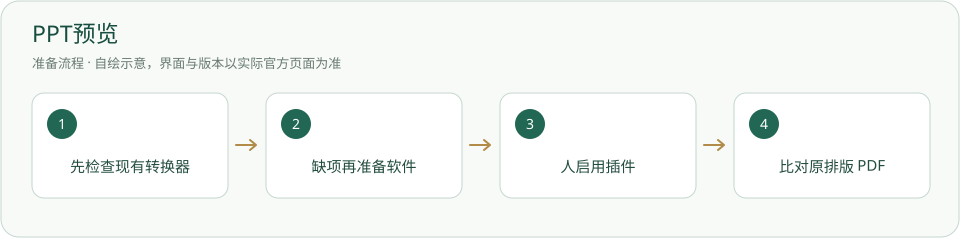

# PPT预览 · 安装与使用

用本机 PowerPoint 或 LibreOffice 只读转换 PDF，查看原排版。

> 转换器有一个即可；不附带 Office，插件通过不等于特定软件已安装。



## 什么时候需要

要看 PPT 原排版。平台基础 PPT 文字和图片读取已可用，不用装此插件才能读内容。

## 输入、调用与输出

输入：自己授权的 PPT/PPTX。调用：插件用本机转换器只读生成 PDF。输出：索引/预览缓存中的 PDF，原幻灯片不改。

## 官网与下载入口

- [官方入口](https://www.libreoffice.org/)
- [下载或官方安装说明](https://www.libreoffice.org/download/)

## Windows 与安装位置

插件随项目。外部 PowerPoint 用用户自己的许可证；LibreOffice 由用户安装在非内置位置。自选 LibreOffice 目录必须让后台环境找到 soffice。

本页面向 Windows 桌面；其他系统请选官网对应发行并按其说明操作，本项目未在本轮宣称跨系统实测。

## 操作步骤

1. 在项目根运行下方检查。显示“用 PowerPoint”或“用 LibreOffice”即可复用，不重复装另一套。

2. 均没有时，按[LibreOffice](LibreOffice.md)从官方准备；核对架构、位置和字体。

3. 由人在工具页检查/启用，在授权 PPT 的文件预览中选择插件。启用不由 agent 擅自代点。

4. 比对实际 PDF 页数、版面与原 PPT，确认原文件指纹没有变化。转换结果不是可编辑 PPT，动画不能按原互动形式在 PDF 播放。

## 安装授权与调用范围

用户自己运行下面的安装命令前，确认安装对象、位置、来源与许可。agent 只有得到对应安装授权才能执行；已有明确授权可引用原记录。安装软件、启用插件、允许自动开工是三件不同的事。指南不会自动下载安装、登录、启用插件或启动员工。可执行软件不放入必须复制的内置资料。

## 怎么检查成功

下面是给你操作的命令说明，本次写文档没有实际执行安装。带示例目录的命令先替换真实路径；项目相对路径命令在项目根执行。

```powershell
powershell -NoProfile -ExecutionPolicy Bypass -File 插件/PPT预览/检查.ps1
```

检查显示一个可用转换器；实际授权 PPT 能生成并显示 PDF，页数和基本排版可核。程序检测成功与转换成功分开记录。

## 失败时怎样处理

- 自选目录找不到 LibreOffice：核对 program/soffice.exe 与后台启动 PATH；不要说已经安装就必定接通。

- 字体或页面不同：读转换器输出并检查本机字体，保留原 PPT。

- 转换失败：保存原报错与缓存状态，按插件超时处理，不反复弹出/关闭用户现有 Office 窗口。


插画不代表真实 PPT 转换结果。详细调用与原文件保护见插件正本 `插件/PPT预览/插件.md`。


## 官方来源与核验范围

核验日期：2026-10-05。只读查看官方资料与本项目现有文件；软件、账户、实际安装和功能试跑并未在本文编写时重新验收。正文访问受限的来源在条目中标明，不把检索结果写成安装成功。

- [LibreOffice 下载](https://www.libreoffice.org/download/)
- [官方安装说明](https://www.libreoffice.org/installation-instructions/)

[返回安装指南总览](../从这里开始.md)


## 国内与国外安装方案

[国内安装方案](../方案/ppt-preview-cn.md) · [国外安装方案](../方案/ppt-preview-global.md)。入口区分下载来源、账号与模型服务；镜像不等于服务可用。详细选择见[两套方案总览](../国内与国外方案.md)。
