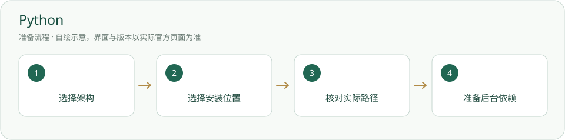

# Python · 安装与使用

让本地工作台和 MCP 能运行；安装依赖前先认准解释器。

> 本项目实测 Python 3.12 系列；这不表示 3.12 是当前最新安全版本。



## 什么时候需要

第一次在这台 Windows 电脑运行工作台。若已有解释器，先检查，不重复安装。

## 输入、调用与输出

输入：平台脚本或获准实验脚本。调用：指定 Python 完整路径运行。输出：脚本日志、平台本机网页或任务产物；不会因此自动启动模型。

## 官网与下载入口

- [官方入口](https://www.python.org/)
- [下载或官方安装说明](https://www.python.org/downloads/windows/)

## Windows 与安装位置

原有可用 Python 可以继续使用。新装时可在官方安装器选择用户目录或非内置的工具目录；记录 python.exe 完整路径。不要把 Python 程序放入本项目的“内置”。

本页面向 Windows 桌面；其他系统请选官网对应发行并按其说明操作，本项目未在本轮宣称跨系统实测。

## 操作步骤

1. 按 Windows“设置 → 系统 → 关于”中的系统类型选择 x64 或 ARM64；不要把架构名称当版本号。

2. 打开官方下载页。按项目的已验证系列选择发行包；Windows 页面里的 3.12.10 是 3.12 最后列有完整安装器的版本，不能称为最新安全版本。选择其他系列前先确认后台和 pywinpty 的兼容性。

3. 运行官方安装器，确认包含 pip。需要自选目录时使用 Customize installation；PATH 和文件关联由你决定。不要选择嵌入式包代替普通工作环境。

4. 新开 PowerShell，检查版本和实际解释器路径。命令不存在时，在安装目录找到 python.exe，用完整路径运行。

5. 到[后台依赖](后台依赖.md)按同一解释器准备环境；MCP 也必须使用该解释器。

## 安装授权与调用范围

用户自己运行下面的安装命令前，确认安装对象、位置、来源与许可。agent 只有得到对应安装授权才能执行；已有明确授权可引用原记录。安装软件、启用插件、允许自动开工是三件不同的事。指南不会自动下载安装、登录、启用插件或启动员工。可执行软件不放入必须复制的内置资料。

## 怎么检查成功

下面是给你操作的命令说明，本次写文档没有实际执行安装。带示例目录的命令先替换真实路径；项目相对路径命令在项目根执行。

```powershell
python --version
python -c "import sys, platform; print(sys.executable); print(sys.version); print(platform.machine())"
python -m pip --version
```

命令退出正常，显示 Python 版本、实际路径与 pip；记下这三项再继续。仅看到版本不代表后台依赖已经齐全。

## 失败时怎样处理

- 命令打开 Microsoft Store：找实际安装的 python.exe，不把商店入口当解释器。

- 路径有空格：PowerShell 用调用符，例如 `& 'D:/Tools/Python312/python.exe' --version`。

- 中文输出乱码：运行脚本时加 `-X utf8`。下载或安装失败保留完整报错，核对官方来源、架构和权限，不自动换第三方包。

## 官方来源与核验范围

核验日期：2026-10-05。只读查看官方资料与本项目现有文件；软件、账户、实际安装和功能试跑并未在本文编写时重新验收。正文访问受限的来源在条目中标明，不把检索结果写成安装成功。

- [Python Windows 下载](https://www.python.org/downloads/windows/)
- [Python 3.12 Windows 使用说明](https://docs.python.org/3.12/using/windows.html)
- [venv 官方说明](https://docs.python.org/3/library/venv.html)

## 官方标识与来源

[-](https://www.python.org/)

Python 和 Python 标识属于 Python Software Foundation；原样标识仅用于识别 Python 软件。

官方 Logo 页允许使用原样标识说明 Python 使用与兼容；不表示 PSF 赞助本项目。 详见[图片来源与使用条件](../应用图片/来源.md)。

[返回安装指南总览](../从这里开始.md)


## 国内与国外安装方案

[国内安装方案](../方案/python-cn.md) · [国外安装方案](../方案/python-global.md)。入口区分下载来源、账号与模型服务；镜像不等于服务可用。详细选择见[两套方案总览](../国内与国外方案.md)。
