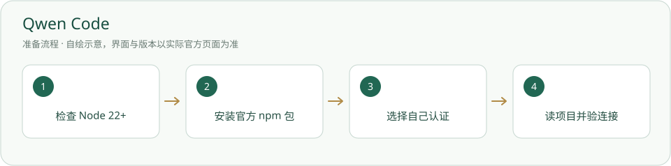

# Qwen Code · 安装与使用

可选通义命令行 agent；按官方 Node 前提安装并选择认证。

> 官方手动 npm 安装要求 Node 22+；没有保证所有地区、账号或模型免费。



## 什么时候需要

用户选择 Qwen Code 命令行操作项目时。

## 输入、调用与输出

输入：项目记录和获准任务。调用：真实 qwen 客户端。输出：文件和交接。认证、额度及可用模型由用户选择的官方方式提供。

## 官网与下载入口

- [官方入口](https://qwenlm.github.io/qwen-code-docs/en/users/quickstart/)
- [下载或官方安装说明](https://qwenlm.github.io/qwen-code-docs/en/users/quickstart/)

## Windows 与安装位置

安装于自己的 Node/npm 用户工具环境，不放入项目内置；Python 后台依赖仍是独立环境。

本页面向 Windows 桌面；其他系统请选官网对应发行并按其说明操作，本项目未在本轮宣称跨系统实测。

## 操作步骤

1. 按[Node.js](Node.js.md)检查 Node 22 或更高，再打开 Qwen 官方入门核对当前要求。

2. 使用下方官方 npm 包名安装；已有客户端先检查，不自动升级。

3. 新开终端检查 qwen 版本，在当前项目根启动，选择官方当前支持的认证方式。

4. 让 agent 先读 AGENTS.md，并按其当前 stdio MCP 配置方式接项目；不承诺 .mcp.json 在每家客户端都会自动读取。

## 安装授权与调用范围

用户自己运行下面的安装命令前，确认安装对象、位置、来源与许可。agent 只有得到对应安装授权才能执行；已有明确授权可引用原记录。安装软件、启用插件、允许自动开工是三件不同的事。指南不会自动下载安装、登录、启用插件或启动员工。可执行软件不放入必须复制的内置资料。

## 怎么检查成功

下面是给你操作的命令说明，本次写文档没有实际执行安装。带示例目录的命令先替换真实路径；项目相对路径命令在项目根执行。

```powershell
node --version
npm.cmd --version
npm.cmd install -g @qwen-code/qwen-code@latest
qwen --version
qwen
```

Node 满足要求，CLI 版本和登录真实可用，读取当前项目成功；MCP 接入结果另核身份与路径。

## 失败时怎样处理

- Node 版本过低：按官方前提选择版本，不在后台 Python 环境“装 Node”。

- 认证/网络失败：保留报错，不填写作者密钥。

- MCP 配置未知：读客户端当前说明；没有 MCP 也可按普通项目文件做获准任务。

## 官方来源与核验范围

核验日期：2026-10-05。只读查看官方资料与本项目现有文件；软件、账户、实际安装和功能试跑并未在本文编写时重新验收。正文访问受限的来源在条目中标明，不把检索结果写成安装成功。

- [Qwen Code 官方入门与 npm 包](https://qwenlm.github.io/qwen-code-docs/en/users/quickstart/)

[返回安装指南总览](../从这里开始.md)


## 官方页面入口

-

来源：[https://qwenlm.github.io/qwen-code-docs/en/users/quickstart/](https://qwenlm.github.io/qwen-code-docs/en/users/quickstart/)；截图日期：2026-10-05。请从上述官网链接进入，实际版本与安装选项以你打开官网时为准。原网站及标识权利归原方；使用说明见[截图来源](../应用截图/来源.md)。


## 国内与国外安装方案

[国内安装方案](../方案/qwen-code-cn.md) · [国外安装方案](../方案/qwen-code-global.md)。入口区分下载来源、账号与模型服务；镜像不等于服务可用。详细选择见[两套方案总览](../国内与国外方案.md)。


## 官方文档网站标识

-

[标识来源官网](https://qwenlm.github.io/qwen-code-docs/en/users/quickstart/)；原样保存，用于识别软件/来源。详细出处、权利与使用条件见[图片来源](../应用图片/来源.md)。
