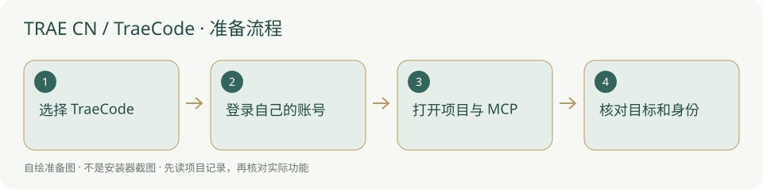

# TRAE CN / TraeCode · 安装与使用

国内版编程客户端，选 TraeCode 打开项目，先核对账号与 MCP。

> TraeCode 与 TraeWork 是不同产品；安装入口不等于当前自动运行器支持。



## 什么时候需要

你希望在国内版图形编程客户端里读项目文件、写获准内容。若只要办公桌面伙伴，官网另有 TraeWork；本页的 MCP 编程步骤针对 TraeCode。

## 输入、调用与输出

输入：本项目目录、AGENTS.md、已明确的目标和验收。调用：TraeCode 中有相应文件、终端与 MCP 权限的智能体。输出：获准文件改动、检查与项目交接；模型和账号由 TRAE 提供，本工作台不供应模型。

## 官网与下载入口

- [官方入口](https://www.trae.cn/)
- [官方软件下载 / 安装说明](https://www.trae.cn/ide/download)
- [国内安装方案](../方案/trae-cn-cn.md)
- [国外安装方案](../方案/trae-cn-global.md)

## Windows 与安装位置

当前国内官方下载页列 Windows 10/11 x64、macOS 12+ 与 Linux 包。按系统“关于”核对架构；Windows ARM64 原生安装包未在本次下载页核实，不能自动选 x64 称原生兼容。安装位置由用户选择，程序及账号放非内置目录。

本项目本轮只读核验资料，未试装该客户端、未登录账号、未扩大系统支持范围。

## 操作步骤

1. 打开国内官方下载页，选择 **TraeCode** 的 Windows x64；不要把 TraeWork 下载按钮当作同一安装包。

2. 阅读安装器来源与协议，在自选非内置位置安装；打开后按当前登录页使用自己可用的手机号或官方列出的其他账号方式。

3. 打开自己的项目根目录，先让智能体读 AGENTS.md 及项目自带技能；先要求概述目标，不直接给它任意文件写权限。

4. AI 设置的 MCP 页选择手动添加；使用下文的本地命令参数，再将 research-console 加入需要执行任务的智能体。

5. 只读调用项目总览，核对身份与路径；写入和自动开工按已有任务授权执行。

## 安装授权与调用范围

安装目录由你选择，内置只带说明与图示，不把程序和认证复制到新项目。软件安装、文件写入、连接 MCP、自动开工分别按实际权限和已有授权执行；安装了客户端不能当作允许修改所有项目。个人账号、密钥和数据保留本机，不写进模板。

## 怎么检查成功

下面是供用户操作的说明命令，**本次没有执行安装或启动客户端**。先替换占位为本机真实路径；检查命令不是成功记录。

```powershell
Test-Path "<项目绝对路径>/AGENTS.md"
Test-Path "<项目绝对路径>/backend/mcp_server.py"
& "<后台实际 python.exe 路径>" -m pip show mcp
```

客户端“关于”能显示实际版本，模型能回复已打开的项目；MCP 返回同一项目目标。没有本项目新客户端检测器，工具页仍可显示未检查，不因此推断安装失败。

## MCP 与项目接手

官方自定义智能体文档明确允许加入 MCP Server；官方 FAQ 说明本地 stdio。当前界面名可能变化，以官方 MCP 页为准。服务名填 `research-console`；传输选 **stdio / 本地命令**，Python 用后台同一个解释器的完整路径。参数按下面顺序独立填写：

```text
<项目绝对路径>/backend/mcp_server.py
--project
<项目绝对路径>
--agent
<你自己这位员工的名称>
```

路径与员工名必须替换为本机真实值。不要照抄作者个人路径、历史 G 编号或他人的账户。第一次只让客户端调用 `get_overview` / `list_skills`，核对网页项目名称；随后依照 [Agent接入](../Agent接入.md) 报到、读取适用戒律。Python 找得到、MCP 已连接、模型能调用工具和自动运行器已适配，是四个不同的检查。


## 失败时怎样处理

- 官网报地区或网络错误：记录下载页与时间；国内/国际客户端按真实账户选择，不套用代理下载站。

- MCP 添加了但智能体看不到：核对是否分配给当前智能体，再检查完整 Python 路径及后台依赖。

- 任务出现运行器启动错误：此页没有新增 TraeCode 的自动运行适配，先用客户端手工读取与接手。

## 官方来源与核验范围

核验日期：2026-10-05。核验官方页面和公开说明，不等于真实下载安装、登录、额度或本项目 MCP 实连验收。未核到的入口明确保留未知；本轮没有新增客户端运行器适配。

- [官方下载](https://www.trae.cn/ide/download)
- [官方入门](https://docs.trae.cn/ide_get-started-with-trae)
- [官方智能体](https://docs.trae.cn/ide_agent)
- [官方 MCP FAQ](https://forum.trae.cn/t/topic/65)
- [国际版](https://www.trae.ai/download)

[返回安装指南总览](../从这里开始.md)


## 国内与国外安装方案

[国内安装方案](../方案/trae-cn-cn.md) · [国外安装方案](../方案/trae-cn-global.md)。入口区分下载来源、账号与模型服务；镜像不等于服务可用。详细选择见[两套方案总览](../国内与国外方案.md)。
