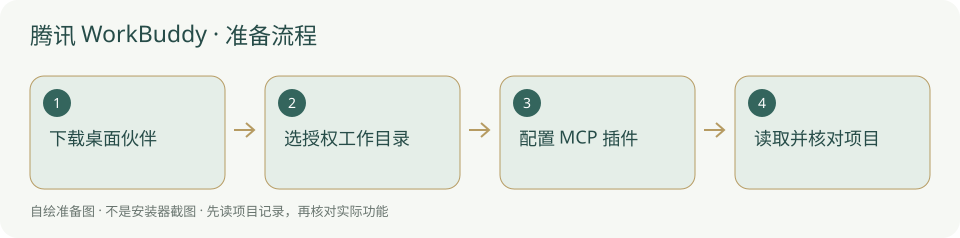

# 腾讯 WorkBuddy · 安装与使用

腾讯桌面工作伙伴，适合文件与办公任务，可配置 MCP 插件。

> WorkBuddy 与 CodeBuddy IDE 分开；本页未新增自动启动或实连验收。



## 什么时候需要

你想使用腾讯独立桌面伙伴处理授权项目中的文档、表格、文件或工作任务。代码编辑专用 IDE 可另选 CodeBuddy IDE。

## 输入、调用与输出

输入：自己选定的工作目录、材料和任务；调用：WorkBuddy 桌面会话，必要时使用获准 MCP/技能；输出：文件与检查记录。桌面可操作文件不代表默认可改所有项目。

## 官网与下载入口

- [官方入口](https://www.workbuddy.cn/)
- [官方软件下载 / 安装说明](https://www.workbuddy.cn/)
- [国内安装方案](../方案/workbuddy-cn.md)
- [国外安装方案](../方案/workbuddy-global.md)

## Windows 与安装位置

官方页提供 Windows 与 macOS；当前 Windows 描述为 x64 并兼容 ARM64，不应写成已核到 ARM64 原生安装包。Mac 按 Intel / Apple 芯片选包。安装位置由用户选择，账户和应用数据不放内置。

本项目本轮只读核验资料，未试装该客户端、未登录账号、未扩大系统支持范围。

## 操作步骤

1. 从独立 WorkBuddy 官网下载与你电脑相符的桌面版；不要从 CodeBuddy IDE 下载按钮误装另一产品。

2. 启动后按实际欢迎页使用自己的账号登录；阅读文件、应用连接与电脑操作权限，先选本项目需要的工作目录。

3. 开始会话时明确项目根，让它先读 AGENTS.md、当前目标和任务；系统设置可管理模型和账号，不把他人的用户级配置照搬过来。

4. 从左侧插件入口查看 MCP 插件，按官方 MCP 配置页添加本地项目服务；如当前版入口变化，从官方帮助定位。

5. 先只读项目总览，核对当前工作目录与员工身份；获准后才写入和执行任务。

## 安装授权与调用范围

安装目录由你选择，内置只带说明与图示，不把程序和认证复制到新项目。软件安装、文件写入、连接 MCP、自动开工分别按实际权限和已有授权执行；安装了客户端不能当作允许修改所有项目。个人账号、密钥和数据保留本机，不写进模板。

## 怎么检查成功

下面是供用户操作的说明命令，**本次没有执行安装或启动客户端**。先替换占位为本机真实路径；检查命令不是成功记录。

```powershell
Test-Path "<项目绝对路径>/AGENTS.md"
Test-Path "<项目绝对路径>/backend/mcp_server.py"
& "<后台实际 python.exe 路径>" -m pip show mcp
```

“关于”有实际版本，当前会话能读选定项目；启用 MCP 时工具列表和 get_overview 返回真实项目。页面小标识或下载入口没有对应安装检测，状态保持未检查。

## MCP 与项目接手

官方插件系统列出 MCP 类型，系统设置说明可加载用户级 .codebuddy 配置；本页不假定不同版本所有路径相同。用当前官方 MCP 指南的可视化配置填下面本地参数。服务名填 `research-console`；传输选 **stdio / 本地命令**，Python 用后台同一个解释器的完整路径。参数按下面顺序独立填写：

```text
<项目绝对路径>/backend/mcp_server.py
--project
<项目绝对路径>
--agent
<你自己这位员工的名称>
```

路径与员工名必须替换为本机真实值。不要照抄作者个人路径、历史 G 编号或他人的账户。第一次只让客户端调用 `get_overview` / `list_skills`，核对网页项目名称；随后依照 [Agent接入](../Agent接入.md) 报到、读取适用戒律。Python 找得到、MCP 已连接、模型能调用工具和自动运行器已适配，是四个不同的检查。


## 失败时怎样处理

- 插件市场能打开但自建服务连不上：核对 Python、参数和实际目录，不额外安装与本服务无关的 Docker。

- 读取到了用户级 .codebuddy 配置：检查是否与你当前项目规则冲突，保留个人密钥在本机。

- 桌面关闭后仍后台执行：按应用实际退出与任务状态核对，先停止已有任务再处理接手，不把关窗口当终止证明。

## 官方来源与核验范围

核验日期：2026-10-05。核验官方页面和公开说明，不等于真实下载安装、登录、额度或本项目 MCP 实连验收。未核到的入口明确保留未知；本轮没有新增客户端运行器适配。

- [独立官网](https://www.workbuddy.cn/)
- [腾讯云介绍](https://cloud.tencent.com/act/pro/workbuddy)
- [官方插件系统](https://www.codebuddy.cn/docs/workbuddy/Plugins)
- [官方系统设置](https://www.codebuddy.cn/docs/workbuddy/From-Beginner-to-Expert-Guide/Function-Description/Setting)
- [官方 MCP 配置](https://www.codebuddy.cn/docs/workbuddy/From-Beginner-to-Expert-Guide/Function-Description/MCP-Guide)

[返回安装指南总览](../从这里开始.md)


## 国内与国外安装方案

[国内安装方案](../方案/workbuddy-cn.md) · [国外安装方案](../方案/workbuddy-global.md)。入口区分下载来源、账号与模型服务；镜像不等于服务可用。详细选择见[两套方案总览](../国内与国外方案.md)。


## 官方小标识

-

[标识来源官网](https://www.workbuddy.cn/)；原样保存，用于识别软件/来源。详细出处、权利与使用条件见[图片来源](../应用图片/来源.md)。


## 官方页面入口

-

来源：[官方下载 / 产品页](https://www.workbuddy.cn/)；截图日期：2026-10-05。用于定位官方下载入口，不代表本机已安装、登录或实连。记录见[截图来源](../应用截图/来源.md)。
