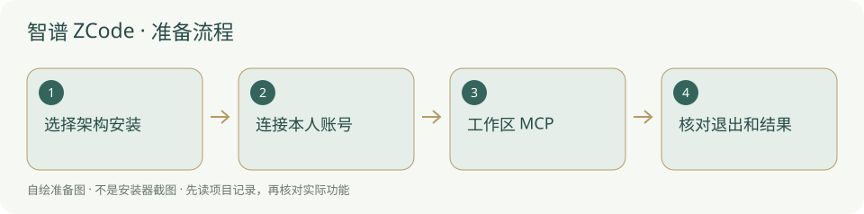

# 智谱 ZCode · 安装与使用

智谱桌面编程 agent，国内可用 BigModel 账号，国际可用 Z.ai。

> 官网明确支持本地 stdio MCP；套餐、版本和地区按当前账号核对。



## 什么时候需要

希望通过智谱桌面客户端做获准文件、代码和工具任务。这里指 zcode.z.ai 官方产品，不是其他同名 GitHub 项目。

## 输入、调用与输出

输入：项目目录、目标及任务。调用：ZCode 桌面 agent 与获准 MCP；输出：文件、检查和交接。模型可经 BigModel/Z.ai 账号套餐登录，也可选择官方支持的 API Key 方式。

## 官网与下载入口

- [官方入口](https://zcode.z.ai/cn)
- [官方软件下载 / 安装说明](https://zcode.z.ai/cn/docs/install)
- [国内安装方案](../方案/zcode-cn.md)
- [国外安装方案](../方案/zcode-global.md)

## Windows 与安装位置

官网提供 Windows x64 / ARM64、macOS Intel / ARM 和 Linux 多种包；先按系统类型选包。程序安装目录用户自选，账号、模型凭据及个人配置保持本机非内置。

本项目本轮只读核验资料，未试装该客户端、未登录账号、未扩大系统支持范围。

## 操作步骤

1. 打开官方安装页，选择 Windows 与实际 x64/ARM64 架构，下载并按向导安装。

2. 首次欢迎页选择国内 BigModel 或国际 Z.ai 账号授权；套餐与额度核对账号实际状态。自行选择 API Key 时，国内/国际端点不能混用。

3. 选择自己的项目工作区，先读 AGENTS.md；模型选择器下的“管理模型”用于核对供应商与账号，不导入作者密钥。

4. 设置 → MCP 服务器 → 新建，选择本地 stdio；首次优先当前工作区范围，填写下文实际命令和参数。

5. 确认工具列表并只读项目总览；需要停止时检查任务状态，关闭窗口可能只是最小化托盘，要使用真实退出入口。

## 安装授权与调用范围

安装目录由你选择，内置只带说明与图示，不把程序和认证复制到新项目。软件安装、文件写入、连接 MCP、自动开工分别按实际权限和已有授权执行；安装了客户端不能当作允许修改所有项目。个人账号、密钥和数据保留本机，不写进模板。

## 怎么检查成功

下面是供用户操作的说明命令，**本次没有执行安装或启动客户端**。先替换占位为本机真实路径；检查命令不是成功记录。

```powershell
Test-Path "<项目绝对路径>/backend/mcp_server.py"
& "<后台实际 python.exe 路径>" -m pip show mcp
```

实际版本可读，正确供应商账号可运行模型，所选工作区与网页一致；MCP 返回该项目目标，退出后不会把托盘残留当已终止。

## MCP 与项目接手

官方 MCP 服务文档明确本地 stdio、command/args/env 与用户或工作区范围。服务名填 `research-console`；传输选 **stdio / 本地命令**，Python 用后台同一个解释器的完整路径。参数按下面顺序独立填写：

```text
<项目绝对路径>/backend/mcp_server.py
--project
<项目绝对路径>
--agent
<你自己这位员工的名称>
```

路径与员工名必须替换为本机真实值。不要照抄作者个人路径、历史 G 编号或他人的账户。第一次只让客户端调用 `get_overview` / `list_skills`，核对网页项目名称；随后依照 [Agent接入](../Agent接入.md) 报到、读取适用戒律。Python 找得到、MCP 已连接、模型能调用工具和自动运行器已适配，是四个不同的检查。


## 失败时怎样处理

- 额度用不了：核对 BigModel 与 Z.ai 的账号/套餐是否对应，不把试用描述当永久免费。

- MCP 连接错误：检查完整路径、命令参数、工作区作用域及后台依赖。

- Windows 终端语法报错：官方默认 shell 可能选 Git Bash 或 cmd，按实际 shell 使用命令，不强称所有窗口是 PowerShell。

## 官方来源与核验范围

核验日期：2026-10-05。核验官方页面和公开说明，不等于真实下载安装、登录、额度或本项目 MCP 实连验收。未核到的入口明确保留未知；本轮没有新增客户端运行器适配。

- [国内安装](https://zcode.z.ai/cn/docs/install)
- [国际安装](https://zcode.z.ai/en/docs/install)
- [模型与账号](https://zcode.z.ai/cn/docs/configuration)
- [官方 MCP](https://zcode.z.ai/cn/docs/mcp-services)

[返回安装指南总览](../从这里开始.md)


## 国内与国外安装方案

[国内安装方案](../方案/zcode-cn.md) · [国外安装方案](../方案/zcode-global.md)。入口区分下载来源、账号与模型服务；镜像不等于服务可用。详细选择见[两套方案总览](../国内与国外方案.md)。


## 官方小标识

-

[标识来源官网](https://zcode.z.ai/cn)；原样保存，用于识别软件/来源。详细出处、权利与使用条件见[图片来源](../应用图片/来源.md)。


## 官方页面入口

-

来源：[官方下载 / 产品页](https://zcode.z.ai/cn)；截图日期：2026-10-05。用于定位官方下载入口，不代表本机已安装、登录或实连。记录见[截图来源](../应用截图/来源.md)。
