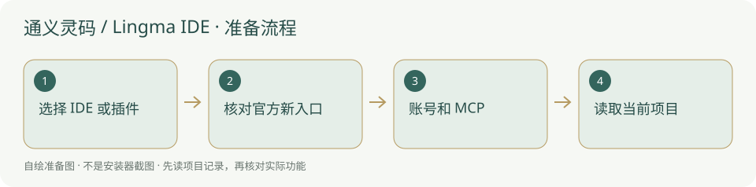

# 通义灵码 / Lingma IDE · 安装与使用

阿里云编程客户端或 IDE 插件；注意官方文档已提示 Qoder CN 新入口。

> 旧 Lingma 与当前 Qoder CN 页面存在名称变化，按下载页核对，不冒称全部功能已实连。



## 什么时候需要

选择阿里云的编程 IDE 或现有编辑器插件，结合项目普通文件和可选 MCP 执行任务。

## 输入、调用与输出

输入：当前项目和已确认任务；调用：Lingma IDE 或兼容编辑器中的阿里云编程助手；输出：文件、检查与交接。项目技能仍是普通文件，不需要复制作者个人技能。

## 官网与下载入口

- [官方入口](https://lingma.aliyun.com/)
- [官方软件下载 / 安装说明](https://lingma.aliyun.com/download)
- [国内安装方案](../方案/lingma-cn.md)
- [国外安装方案](../方案/lingma-global.md)

## Windows 与安装位置

本次 Lingma 官方下载页列 Windows 10/11 x64 User 安装包、macOS 11+ ARM 与 Linux x64；其他架构需核对官方实时列表。IDE 与 VS Code/JetBrains 插件是两种安装方式。程序不放内置，已有编辑器无需再装另一整套 IDE。

本项目本轮只读核验资料，未试装该客户端、未登录账号、未扩大系统支持范围。

## 操作步骤

1. 打开官方软件下载页，选择独立 IDE 或你已有编辑器对应的插件，不重复安装全部形式。

2. Windows IDE 下载 x64 User 包并自选非内置位置；插件从官方说明跳编辑器市场，JetBrains 离线 ZIP 也必须沿官方下载页获取。

3. 用自己的阿里云账号按欢迎页登录，核对服务与套餐；官方旧使用文档目前显示 Qoder CN 并提示 docs.qoder.cn 新入口。

4. 打开当前项目，让智能体先读 AGENTS.md；需要 MCP 时，按客户端当前的 MCP 管理或 JSON 配置加入 stdio 项目服务。

5. 切到具备工具调用的智能体模式，先读目标；确认是本项目后才处理获准任务。

## 安装授权与调用范围

安装目录由你选择，内置只带说明与图示，不把程序和认证复制到新项目。软件安装、文件写入、连接 MCP、自动开工分别按实际权限和已有授权执行；安装了客户端不能当作允许修改所有项目。个人账号、密钥和数据保留本机，不写进模板。

## 怎么检查成功

下面是供用户操作的说明命令，**本次没有执行安装或启动客户端**。先替换占位为本机真实路径；检查命令不是成功记录。

```powershell
Test-Path "<项目绝对路径>/AGENTS.md"
& "<后台实际 python.exe 路径>" -m pip show mcp
```

实际 IDE/插件版本可读，自己的阿里云账号能用，当前智能体可读项目；MCP 若启用需实际返回本项目总览。只装插件、仅聊天回复或网页登录成功都不等于 MCP 已连接。

## MCP 与项目接手

阿里云官方 MCP 使用文档介绍 stdio 与 SSE、本地命令及 JSON；同时明确旧站内容不再更新，转向 Qoder CN。这里保留核验到的项目参数，具体界面入口以新版文档为准。服务名填 `research-console`；传输选 **stdio / 本地命令**，Python 用后台同一个解释器的完整路径。参数按下面顺序独立填写：

```text
<项目绝对路径>/backend/mcp_server.py
--project
<项目绝对路径>
--agent
<你自己这位员工的名称>
```

路径与员工名必须替换为本机真实值。不要照抄作者个人路径、历史 G 编号或他人的账户。第一次只让客户端调用 `get_overview` / `list_skills`，核对网页项目名称；随后依照 [Agent接入](../Agent接入.md) 报到、读取适用戒律。Python 找得到、MCP 已连接、模型能调用工具和自动运行器已适配，是四个不同的检查。


## 失败时怎样处理

- 旧文档自动显示 Qoder CN：用官方新文档入口核对正在安装的产品，不拿旧 Lingma 图片冒充新品牌。

- 普通问答模式没有工具：切换官方当前支持 MCP 的智能体模式。

- 阿里云账号或企业策略阻止调用：记录提示，用户自己确认访问资格；不复制他人认证。

## 官方来源与核验范围

核验日期：2026-10-05。核验官方页面和公开说明，不等于真实下载安装、登录、额度或本项目 MCP 实连验收。未核到的入口明确保留未知；本轮没有新增客户端运行器适配。

- [官方下载](https://lingma.aliyun.com/download)
- [阿里云 MCP 与新站提示](https://help.aliyun.com/zh/lingma/guide-for-using-mcp)
- [官方新文档](https://docs.qoder.cn/)
- [阿里云英文文档](https://help.aliyun.com/en/lingma/)

[返回安装指南总览](../从这里开始.md)


## 国内与国外安装方案

[国内安装方案](../方案/lingma-cn.md) · [国外安装方案](../方案/lingma-global.md)。入口区分下载来源、账号与模型服务；镜像不等于服务可用。详细选择见[两套方案总览](../国内与国外方案.md)。


## 官方小标识

-

[标识来源官网](https://lingma.aliyun.com/)；原样保存，用于识别软件/来源。详细出处、权利与使用条件见[图片来源](../应用图片/来源.md)。


## 官方页面入口

-

来源：[官方下载 / 产品页](https://lingma.aliyun.com/download)；截图日期：2026-10-05。用于定位官方下载入口，不代表本机已安装、登录或实连。记录见[截图来源](../应用截图/来源.md)。
